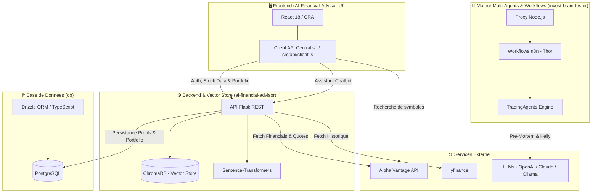

# 📈 AI Stock Advisor System

> **Plateforme d'analyse boursière intelligent, de gestion de portefeuille et d'aide à la décision financière propulsée par l'Intelligence Artificielle et des architectures multi-agents.**

---

## 🎯 But du Projet

**AI Stock Advisor System** a été conçu pour offrir aux investisseurs individuels et institutionnels un tableau de bord financier complet, réactif et éclairé par l'IA.

La plateforme résout trois défis majeurs de l'investissement moderne :
1. **Accès et visualisation des données de marché en temps réel** : Suivi des cours, graphiques interactifs (Candlestick, Line charts), actualités financières et états financiers des entreprises.
2. **Conseil financier augmenté (RAG & Chatbot IA)** : Interaction en langage naturel avec un conseiller virtuel capable d'analyser le portefeuille spécifique de l'utilisateur, les actualités et les métriques boursières.
3. **Évaluation rigoureuse des risques & Allocation de capital** : Utilisation d'agents autonomes d'analyse *Pre-Mortem* (recherche de scénarios de défaillance) et dimensionnement des positions basé sur le **Critère de Kelly**.

---

## 🏗️ Architecture du Système

Le projet repose sur une architecture décisionnelle et logicielle modulaire découpée en 4 sous-systèmes principaux :



---

## 🧩 Composants du Monorepo

| Composant | Stack Technique | Rôle & Responsabilités |
| :--- | :--- | :--- |
| **`AI-Financial-Advisor-UI`** | React 18, Tailwind/CSS, Lightweight-Charts, Recharts | Interface utilisateur réactive (tableaux de bord, graphiques TradingView, chat IA, gestion du portefeuille et fiches de détail des actions). |
| **`ai-financial-advisor`** | Python 3.8+, Flask, ChromaDB, Sentence-Transformers, yfinance | API REST backend, moteur de recherche sémantique (RAG), agrégation des métriques boursières, actualités et cotations. |
| **`db`** | TypeScript, Drizzle ORM, PostgreSQL | Modélisation type-safe de la base de données relationnelle (profils d'investissement, transactions, positions de portefeuille). |
| **`invest-brain-tester`** | Node.js, n8n JSON Workflows, TradingAgents | Banc d'essai et orchestrateur de workflows d'analyse d'investissement à risque asymétrique et d'évaluation adversariale. |

---

## ✨ Fonctionnalités Clés

* 📊 **Analyse Boursière Avancée** :
  * Visualisation dynamique des séries temporelles (Daily, Weekly, Monthly).
  * Rapports financiers (Income Statement, balance sheet), transactions d'initiés et flux d'actualités indexés.
  * Recherche instantanée de symboles et suivi des *Top Movers* (Top Gainers, Top Losers, Most Active).
* 💼 **Gestion de Portefeuille & Suivi du Profil** :
  * Calcul de la valeur totale, allocation par actifs et suivi de la performance globale.
  * Profilage des investisseurs (Objectifs de croissance, tolérance au risque, horizon temporel).
* 🤖 **Assistant IA Financier (RAG - Retrieval-Augmented Generation)** :
  * Chatbot contextuel intégrant les données du portefeuille de l'utilisateur et l'analyse sémantique vectorielle via **ChromaDB**.
* 🛡️ **Gestion Anti-Ruine & Multi-Agents** :
  * **WF1 (Chasseur Asymétrique)** : Sourcing et filtrage automatique des opportunités à fort ratio rendement/risque.
  * **WF2 (Pare-feu Anti-Ruine)** : Challenge adversarial (*Pre-Mortem*) et calcul d'exposition selon la formule de Kelly.
* 🔐 **Centralisation & Sécurité API** :
  * Fichier `.env` isolé et module `src/api/client.js` centralisé pour éviter toute clé d'API ou URL exposée dans le code client.

---

## 🚀 Démarrage Rapide

### Pré-requis
* **Node.js** v18+ et **npm**
* **Python** 3.8+ et `pip`
* **PostgreSQL** (optionnel pour la persistance locale)

### 1. Configuration des variables d'environnement

Copiez les fichiers d'exemples `.env.example` dans chaque sous-projet :

```bash
# Frontend UI
cp AI-Financial-Advisor-UI/.env.example AI-Financial-Advisor-UI/.env

# Backend Flask
cp ai-financial-advisor/.env.example ai-financial-advisor/.env

# Database ORM
cp db/.env.example db/.env
```

Assurez-vous de renseigner votre clé [Alpha Vantage](https://www.alphavantage.co/support/#api-key) dans les fichiers `.env`.

---

### 2. Démarrage du Backend Python (`ai-financial-advisor`)

```bash
cd ai-financial-advisor
python -m venv venv
# Linux/macOS : source venv/bin/activate
# Windows : venv\Scripts\activate
pip install -r requirements.txt
python app.py
```
*Le serveur Flask démarre sur `http://localhost:5000`.*

---

### 3. Démarrage du Frontend React (`AI-Financial-Advisor-UI`)

```bash
cd AI-Financial-Advisor-UI
npm install
npm run stage
```
*L'application React démarre sur `http://localhost:3033`.*

---

### 4. (Optionnel) Schéma de Base de Données (`db`)

```bash
cd db
npm install
npm run push
```

---

## 📄 Licence & Contribution

Ce projet est sous licence privée. Pour toute suggestion ou contribution, veuillez ouvrir une *Issue* ou soumettre une *Pull Request* sur le dépôt officiel :
👉 **[https://github.com/ErnestBariq/AI-Stock-Advisor-System](https://github.com/ErnestBariq/AI-Stock-Advisor-System.git)**
